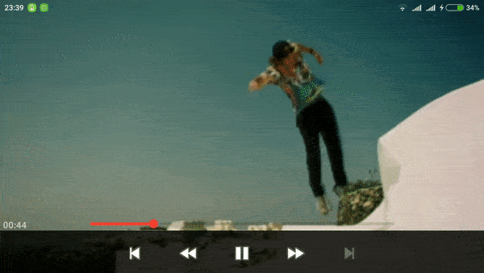

# PreviewSeekBar

A SeekBar suited for showing a preview of something. As seen in Google Play Movies.


### Google Play Movies

</img>

### PreviewSeekBar's sample

</img>


## Build

```groovy
dependencies {
    compile 'com.github.rubensousa:previewseekbar:0.2'
}
```

## How to use

####Add the following XML:

```xml
<com.github.rubensousa.previewseekbar.PreviewSeekBarLayout
      android:id="@+id/previewSeekBarLayout"
      android:layout_width="match_parent"
      android:layout_height="wrap_content"
      android:orientation="vertical">

      <FrameLayout
          android:id="@+id/previewFrameLayout"
          android:layout_width="@dimen/video_preview_width"
          android:layout_height="@dimen/video_preview_height">

          <View
              android:id="@+id/videoView"
              android:layout_width="match_parent"
              android:layout_height="match_parent"
              android:layout_gravity="start"
              android:background="@color/colorPrimary" />

      </FrameLayout>

      <com.github.rubensousa.previewseekbar.PreviewSeekBar
          android:id="@+id/previewSeekBar"
          android:layout_width="match_parent"
          android:layout_height="wrap_content"
          android:layout_below="@id/previewFrameLayout"
          android:layout_marginTop="25dp"
          android:max="800" />
          
</com.github.rubensousa.previewseekbar.PreviewSeekBarLayout>
```
#####You need to add at least one PreviewSeekBar and a FrameLayout inside PreviewSeekBarLayout, else an exception will be thrown.
PreviewSeekBarLayout extends from RelativeLayout so you can add other views or layouts there. 

#### Pass a standard OnSeekBarChangeListener to the seekBar:

```java
// setOnSeekBarChangeListener was overridden to do the same as below
seekBar.addOnSeekBarChangeListener(this);
```

#### Implement your own preview logic in:

```java
@Override
public void onProgressChanged(SeekBar seekBar, int progress, boolean fromUser) {
    // I can't help anymore
}
```

## How to use with ExoPlayer

#### Add a custom controller to your SimpleExoPlayerView

```xml
<com.google.android.exoplayer2.ui.SimpleExoPlayerView
    android:id="@+id/player_view"
    android:layout_width="match_parent"
    android:layout_height="match_parent"
    app:controller_layout_id="@layout/exoplayer_controls"/>
```

Here's the sample's exoplayer_controls: https://github.com/rubensousa/PreviewSeekBar/blob/master/sample/src/main/res/layout/exoplayer_controls.xml

The PreviewSeekBarLayout inside exoplayer_controls should be similar to this:

```xml
<com.github.rubensousa.previewseekbar.PreviewSeekBarLayout
    android:id="@+id/previewSeekBarLayout"
    android:layout_width="0dp"
    android:layout_height="wrap_content"
    android:layout_weight="1"
    android:orientation="vertical">

    <FrameLayout
        android:id="@+id/previewFrameLayout"
        android:layout_width="@dimen/video_preview_width"
        android:layout_height="@dimen/video_preview_height"
        android:background="@drawable/video_frame"
        android:padding="@dimen/video_frame_width">

        <com.google.android.exoplayer2.ui.SimpleExoPlayerView
            android:id="@+id/previewPlayerView"
            android:layout_width="match_parent"
            android:layout_height="match_parent"
            app:controller_layout_id="@layout/exo_simple_player_view"
            app:surface_type="texture_view"
            app:use_artwork="false"
            app:use_controller="false" />

    </FrameLayout>

    <com.github.rubensousa.previewseekbar.PreviewSeekBar
        android:id="@+id/exo_progress"
        style="?android:attr/progressBarStyleHorizontal"
        android:layout_width="match_parent"
        android:layout_height="wrap_content"
        android:layout_below="@id/previewFrameLayout"
        android:layout_marginTop="10dp"
        android:max="800" />

</com.github.rubensousa.previewseekbar.PreviewSeekBarLayout>
```

#### Use the following SimpleExoPlayerView for the preview:

```xml
<com.google.android.exoplayer2.ui.SimpleExoPlayerView
    android:id="@+id/previewPlayerView"
    android:layout_width="match_parent"
    android:layout_height="match_parent"
    app:controller_layout_id="@layout/exo_simple_player_view"
    app:surface_type="texture_view"
    app:use_artwork="false"
    app:use_controller="false" />
```    
    
We need to specify another controller layout because the default one includes a SeekBar with the same id as ours.

#### Create a player with a custom TrackSelection and LoadControl

```java
TrackSelection.Factory videoTrackSelectionFactory = new WorstVideoTrackSelection.Factory();
TrackSelector trackSelector = new DefaultTrackSelector(videoTrackSelectionFactory);
LoadControl loadControl = new PreviewLoadControl();
SimpleExoPlayer previewPlayer = ExoPlayerFactory.newSimpleInstance(previewPlayerView.getContext(),
        trackSelector, loadControl);
previewPlayer.setPlayWhenReady(false);        
```

PreviewLoadControl: https://github.com/rubensousa/PreviewSeekBar/blob/master/sample/src/main/java/com/github/rubensousa/previewseekbar/sample/exoplayer/PreviewLoadControl.java

WorstVideoTrackSelection: https://github.com/rubensousa/PreviewSeekBar/blob/master/sample/src/main/java/com/github/rubensousa/previewseekbar/sample/exoplayer/WorstVideoTrackSelection.java

## Improvements

The sample uses some code adapted from the ExoPlayer official demo: https://github.com/google/ExoPlayer

A few improvements would be:

- Adding a stream with lower bitrate to load and display the images faster

- Using some kind of special stream just for the thumbnails. Maybe this is how the Google Play team did it, I don't know. They load the thumbnails a lot faster than this sample.

Any ideas for improving this would be welcomed!


## License

    Copyright 2016 The Android Open Source Project
    Copyright 2017 Rúben Sousa
    
    Licensed under the Apache License, Version 2.0 (the "License");
    you may not use this file except in compliance with the License.
    You may obtain a copy of the License at
    
        http://www.apache.org/licenses/LICENSE-2.0
    
    Unless required by applicable law or agreed to in writing, software
    distributed under the License is distributed on an "AS IS" BASIS,
    WITHOUT WARRANTIES OR CONDITIONS OF ANY KIND, either express or implied.
    See the License for the specific language governing permissions and
    limitations under the License.
